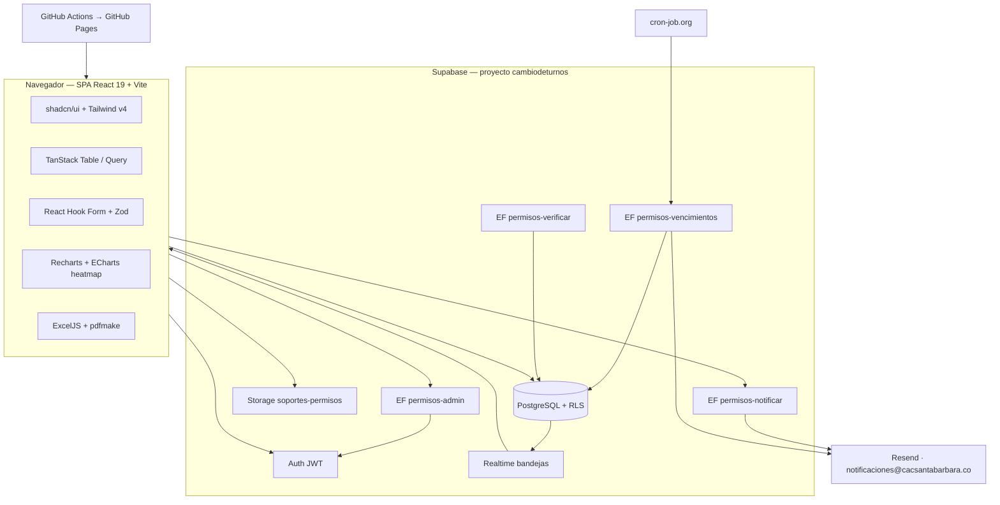
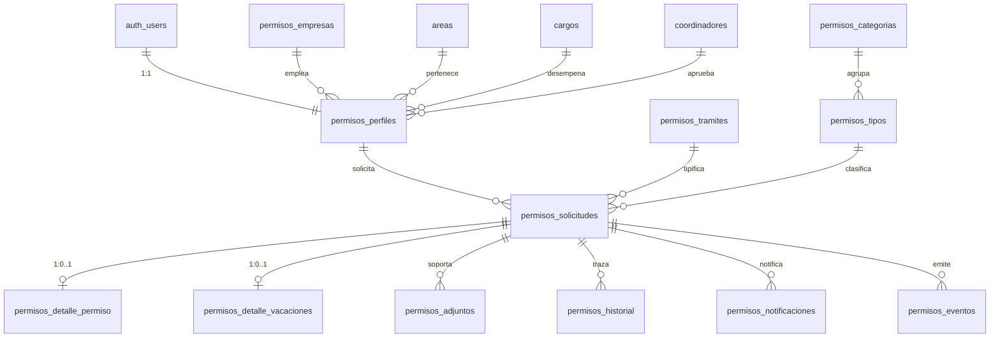
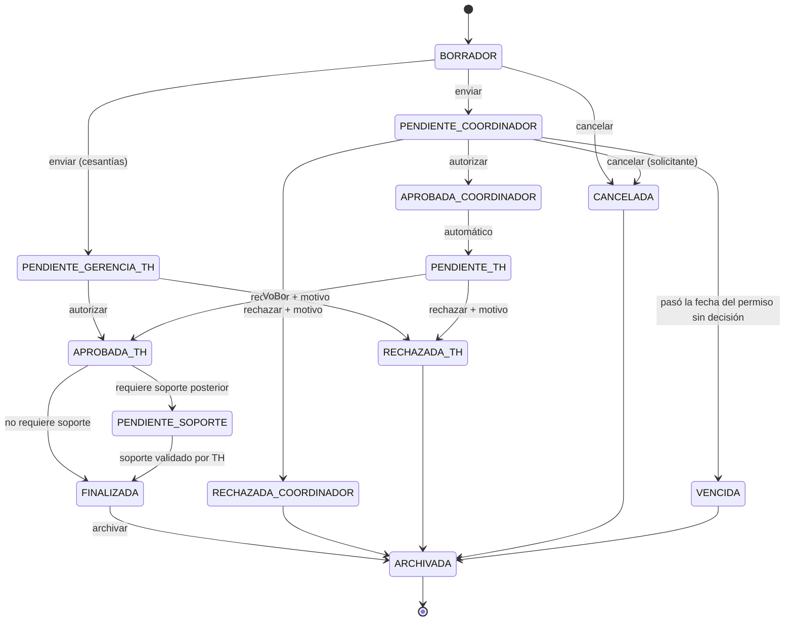
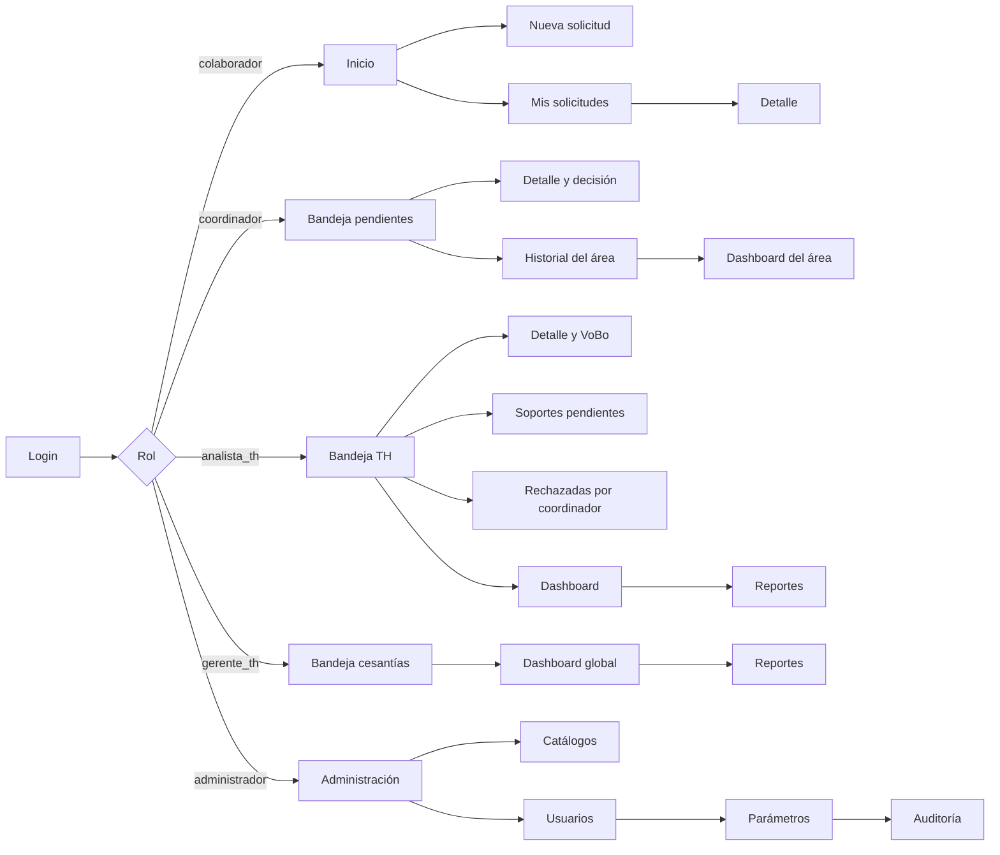

# PERMISOS TTHH — Arquitectura Maestra (para aprobación)

**Proyecto:** Gestión de solicitudes de permisos, ausentismos y vacaciones
**Formatos que reemplaza:** `TH-F-002 V02` (permiso laboral) y `TH-F-005 V02` (vacaciones)
**Cliente:** Clínica de Alta Complejidad Santa Bárbara
**Código fuente:** `C:\www\permisos_tthh`
**Repositorio:** `juanetayo-projects/permisos_tthh`
**Estado:** Diseño — pendiente de aprobación. **Aún no se ha escrito código.**
**Fecha:** 2026-07-29

> Este documento cubre los 10 entregables exigidos en `docs/concepto_general.txt`
> antes de iniciar el desarrollo: arquitectura, modelo de datos, módulos,
> navegación, casos de uso, roles, wireframes, riesgos, mejoras y preguntas
> pendientes.

---

## 0. Decisiones ya aprobadas

| # | Decisión | Elección | Razón |
|---|---|---|---|
| D1 | Stack + hosting | **React 19 + Vite + TypeScript + Tailwind + shadcn/ui**, desplegado en **GitHub Pages** | Consistencia con las ~15 apps clínicas ya en producción; Next.js con SSR no corre en GitHub Pages. La lógica de servidor va en **Edge Functions de Supabase**. |
| D2 | Base de datos | **Reusar el proyecto Supabase `cambiodeturnos`** (`rykondrasrvnuurolqqk`), tablas nuevas con prefijo `permisos_` | US$0 adicionales; reutiliza en vivo `areas` (16), `coordinadores` (23), `cargos` (17) y el padrón de usuarios ya autenticados. |
| D3 | Lenguaje visual | **Híbrido**: base limpia shadcn/Stripe + relieve neumórfico en metric cards y paneles | Resuelve el conflicto entre `prompt_inicial.txt` (neumorfismo) y `concepto_general.txt` (Stripe/Linear/Odoo) sin sacrificar legibilidad en tablas densas. |
| D4 | Motivos de permiso | **Dos niveles**: categoría del formato oficial → tipo específico | El PDF marca la casilla del RED-GTH-F-002 y las estadísticas se hacen por tipo. Ambos catálogos con CRUD. |
| D5 | Registro de usuarios | **Auto-registro con cualquier correo + validación obligatoria de Talento Humano** | No todos los colaboradores tienen cuenta institucional: muchos usan correo personal. El filtro real es la validación de TH, que confirma identidad, área y jefe directo antes de habilitar solicitudes. La restricción por dominio queda **configurable** en `permisos_config.dominios_permitidos` (lista vacía = cualquier dominio) por si la clínica decide cerrarla más adelante. |
| D6 | Roles | **5 roles**: `colaborador`, `coordinador`, `analista_th`, `gerente_th`, `administrador` | Las cesantías llegan directo a `gerente_th` como exige el Paso 4 del prompt. |
| D7 | Firmas | **Sello de trazabilidad + QR de verificación** | Cumple ISO 9001 (usuario, fecha, hora, IP) sin firmas escaneadas ni papel. |
| D8 | Alcance v1 | Núcleo + **Dashboard ejecutivo y mapa de calor** + **Reportes Excel/PDF con logo** + **Testing y CI/CD completo** | El **módulo IA queda fuera de v1** (ver Roadmap §9). |
| D9 | Trámites | **Dos módulos en v1 sobre un motor común**: Permisos (`TH-F-002`) y Vacaciones (`TH-F-005`) | Comparten bandejas, estados, notificaciones, auditoría, dashboard y reportes. Cada trámite aporta su formulario, sus reglas y su PDF. |
| D10 | Códigos de formato | **`TH-F-002` y `TH-F-005`**, encabezado `PROCESO: TALENTO HUMANO`, con código/versión/vigencia **editables** desde parámetros | Son las plantillas vigentes que entregó el cliente. Calidad podrá actualizarlas sin desplegar. Se descarta `RED-GTH-F-002`. |
| D11 | Saldo de vacaciones | **Campos manuales** (días que corresponden / a disfrutar / pendientes) **validados por Talento Humano** antes de aprobar | Réplica del proceso actual; la nómina sigue siendo la fuente de verdad. El motor de saldos automático queda en el roadmap. |
| D12 | Flujo de vacaciones | **Jefe directo → Dirección de Talento Humano** | Coincide con las tres casillas de firma del formato TH-F-005. |

---

## 1. Arquitectura

### 1.1 Vista de capas (Clean Architecture adaptada a SPA + BaaS)

```
┌─────────────────────────────────────────────────────────────┐
│  PRESENTACIÓN   src/pages, src/components                   │
│  Páginas por módulo · Componentes shadcn/ui · Design system  │
├─────────────────────────────────────────────────────────────┤
│  APLICACIÓN     src/features/*/hooks, src/features/*/api     │
│  Casos de uso · TanStack Query · Máquina de estados BPM      │
├─────────────────────────────────────────────────────────────┤
│  DOMINIO        src/domain                                   │
│  Entidades · Value objects · Reglas de negocio puras · Zod   │
│  (sin dependencias de React ni de Supabase)                  │
├─────────────────────────────────────────────────────────────┤
│  INFRAESTRUCTURA  src/infrastructure                         │
│  Cliente Supabase · Repositorios · Storage · Export · Resend │
└─────────────────────────────────────────────────────────────┘
                              │
        ┌─────────────────────┴──────────────────────┐
        ▼                                            ▼
┌──────────────────────┐                 ┌──────────────────────┐
│ Supabase             │                 │ Edge Functions       │
│ Postgres + RLS       │                 │ permisos-notificar   │
│ Auth (JWT)           │                 │ permisos-admin       │
│ Storage (soportes)   │                 │ permisos-vencimientos│
│ Realtime (bandejas)  │                 │ permisos-verificar   │
└──────────────────────┘                 └──────────────────────┘
                                                     │
                                                     ▼
                                              ┌─────────────┐
                                              │   Resend    │
                                              └─────────────┘
```

**Regla de dependencia:** Presentación → Aplicación → Dominio ← Infraestructura.
El dominio no importa nada de React ni de Supabase; así las reglas (cálculo de
horas, regla de 48 h, obligatoriedad de soporte) son testeables con Vitest sin
levantar la app.

### 1.2 Diagrama de componentes



### 1.3 Stack definitivo

| Capa | Tecnología |
|---|---|
| UI | React 19, Vite 6, TypeScript 5 (strict), Tailwind CSS v4, shadcn/ui, Lucide, Framer Motion |
| Formularios | React Hook Form + Zod (esquemas compartidos con el dominio) |
| Datos | TanStack Query v5, TanStack Table v8 |
| Gráficos | Recharts (KPIs y tendencias), ECharts (mapa de calor área × mes) |
| Export | ExcelJS (Excel con logo y colores), pdfmake (PDF del formato RED-GTH-F-002) |
| Routing | react-router-dom v7 con **HashRouter** (obligatorio en GitHub Pages) |
| Backend | Supabase: Postgres 17, Auth, Storage, Realtime, Edge Functions (Deno) |
| Correo | Resend vía Edge Function · API key `notificacionturnos` · remitente `notificaciones@cacsantabarbara.co` |
| Tests | Vitest + Testing Library (unit/integración), Playwright (E2E) |
| CI/CD | GitHub Actions: lint → typecheck → test → build → deploy Pages |

---

## 2. Modelo de datos

### 2.1 Tablas reutilizadas (ya existen en `cambiodeturnos`, se leen sin duplicar)

| Tabla | Filas | Uso en Permisos |
|---|---|---|
| `areas` | 16 | Proceso y/o área del formato |
| `cargos` | 17 | Cargo del colaborador |
| `coordinadores` | 23 | Jefe directo que aprueba (vinculado por `area_id`) |
| `auth.users` | — | Autenticación compartida: quien ya tiene cuenta en Cambio de Turnos entra sin registrarse otra vez |

> `profiles` **no** se reutiliza para roles: su columna `rol` pertenece al dominio
> de Cambio de Turnos. Permisos usa su propia tabla `permisos_perfiles`
> referenciando `auth.users`, para no contaminar la otra app.

### 2.2 Tablas nuevas



> **Patrón elegido — tabla común + detalle por trámite.** `permisos_solicitudes`
> guarda lo que comparten los dos formatos (solicitante, empresa, área, fechas,
> estado, aprobadores, trazabilidad) y cada trámite añade sus campos propios en
> su tabla de detalle. Así las bandejas, el dashboard, la auditoría y los
> reportes son **uno solo**, y añadir un tercer formato mañana (incapacidades,
> teletrabajo) no toca el motor.

**`permisos_empresas`** — `id`, `nombre`, `activo`
Semilla: *CAC Santa Bárbara*, *GE2*, *Geriater* (las tres casillas del formato).

**`permisos_perfiles`** — `user_id` (PK, FK `auth.users`), `nombre`, `correo`,
`tipo_documento`, `documento`, `telefono`, `empresa_id`, `area_id`, `cargo_id`,
`coordinador_id`, `rol`, `estado`, `fecha_ingreso`, `activo`, `created_at`,
`updated_at`, `deleted_at`
- `rol` ∈ `colaborador | coordinador | analista_th | gerente_th | administrador`
- `estado` ∈ `pendiente_validacion | activo | inactivo`

**`permisos_tramites`** — catálogo de formatos que gestiona la app:
`id`, `codigo`, `nombre`, `codigo_formato`, `version_formato`, `vigencia_formato`,
`proceso`, `ruta_aprobacion`, `antelacion_minima`, `unidad_antelacion`, `activo`

| codigo | nombre | codigo_formato | versión | antelación mínima |
|---|---|---|---|---|
| `permiso` | Autorización de permiso laboral | `TH-F-002` | 02 | **48 horas** |
| `vacaciones` | Solicitud y autorización de vacaciones | `TH-F-005` | 02 | **20 días** |

Código, versión y vigencia son **editables desde Administración**: cuando Calidad
publique una versión nueva del formato, el encabezado del PDF cambia sin desplegar.

**`permisos_categorias`** — `id`, `nombre`, `casilla_formato`, `orden`, `activo`
Semilla exacta del formato V2: Personal · Día de la Familia · Salud · Empresarial · Calamidad.

**`permisos_tipos`** — `id`, `categoria_id`, `nombre`, `remunerado_por_defecto`,
`requiere_soporte_previo`, `requiere_soporte_posterior`,
`soporte_obligatorio_desde_dias`, `ruta_aprobacion`, `dias_antelacion_min`,
`activo`
- `ruta_aprobacion` ∈ `coordinador_th` (normal) | `gerente_th_directo` (cesantías)

Semilla propuesta:

| Tipo | Categoría | Ruta | Soporte |
|---|---|---|---|
| Cita médica | Salud | coordinador_th | **Posterior obligatorio si > 2 días** |
| Incapacidad médica | Salud | coordinador_th | Previo obligatorio |
| Licencia de maternidad/paternidad | Salud | coordinador_th | Previo obligatorio |
| Diligencia personal | Personal | coordinador_th | Opcional |
| Votaciones | Personal | coordinador_th | Posterior (certificado) |
| Deberes de acudiente | Personal | coordinador_th | Posterior (constancia) |
| Día de la familia | Día de la Familia | coordinador_th | No aplica |
| Calamidad doméstica | Calamidad | coordinador_th | Opcional |
| Luto | Calamidad | coordinador_th | Posterior (registro de defunción) |
| Movilidad sostenible | Empresarial | coordinador_th | No aplica |
| Solicitud de cesantías | Empresarial | **gerente_th_directo** | Previo obligatorio |

**`permisos_solicitudes`** — núcleo común a los dos trámites
`id` (uuid), `tramite_id`, `consecutivo` (único: `PL-2026-00001` / `VA-2026-00001`),
`solicitante_id`, `empresa_id`, `area_id`, `cargo_id`, `coordinador_id`,
`fecha_solicitud`, `fecha_inicio`, `fecha_fin`, `estado`, `extemporanea`,
`observaciones`, `coord_actor_id`, `coord_fecha`, `coord_ip`,
`th_actor_id`, `th_fecha`, `th_ip`, `motivo_rechazo`, `codigo_verificacion`,
`created_at`, `updated_at`, `deleted_at`

**`permisos_detalle_permiso`** — campos exclusivos del formato TH-F-002
`solicitud_id` (PK/FK), `categoria_id`, `tipo_id`, `tipo_otro`, `hora_salida`,
`hora_regreso`, `horas_permiso`, `dias_permiso`, `remunerado`,
`requiere_compensacion`, `plan_compensacion`, `justificacion`,
`requiere_soporte_posterior`, `fecha_limite_soporte`, `soporte_posterior_entregado`

**`permisos_detalle_vacaciones`** — campos exclusivos del formato TH-F-005
`solicitud_id` (PK/FK), `dias_corresponden`, `dias_a_disfrutar`, `dias_pendientes`,
`fecha_reintegro`, `dias_habiles_calculados`, `saldo_validado_por`,
`saldo_validado_en`, `declaracion_aceptada`, `fecha_constancia`

> **Días hábiles y Ley Emiliani.** El ejemplo del formato (6 días a disfrutar,
> del 2 al 9 de enero de 2026, reintegro el 13) solo cuadra contando **lunes a
> viernes, excluyendo festivos colombianos**, y saltando el lunes 12 (Reyes
> trasladado por Ley Emiliani). La app calcula `dias_habiles_calculados` y
> `fecha_reintegro` con `festivosColombia.ts`, y **avisa** cuando no coinciden
> con los días que digitó el colaborador; quien decide sigue siendo Talento
> Humano (D11).

**`permisos_adjuntos`** — `id`, `solicitud_id`, `momento` (`previo|posterior`),
`nombre_archivo`, `ruta_storage`, `mime`, `tamano_bytes`, `subido_por`, `created_at`

**`permisos_historial`** — línea de tiempo BPM: `id`, `solicitud_id`,
`estado_anterior`, `estado_nuevo`, `accion`, `actor_id`, `motivo`, `created_at`

**`permisos_auditoria`** — ISO 9001: `id`, `tabla`, `registro_id`, `accion`,
`actor_id`, `ip`, `user_agent`, `datos_antes` (jsonb), `datos_despues` (jsonb),
`motivo`, `created_at`. Poblada por triggers en todas las tablas del dominio.

**`permisos_notificaciones`** — `id`, `solicitud_id`, `destinatario`, `plantilla`,
`asunto`, `estado`, `resend_id`, `error`, `intentos`, `created_at`

**`permisos_eventos`** — bus de eventos para automatizaciones futuras:
`id`, `tipo` (`SolicitudCreada`, `SolicitudAprobada`, `SolicitudRechazada`,
`DocumentoAdjunto`, `UsuarioRegistrado`, `UsuarioActivado`, `CorreoEnviado`),
`payload` (jsonb), `procesado`, `created_at`

**`permisos_config`** — parámetros editables por el administrador sin desplegar:
`clave`, `valor` (jsonb), `descripcion`. Ej.: `antelacion_minima_horas: 48`,
`dominio_permitido: "cacsantabarbara.co"`, `dias_umbral_soporte_cita_medica: 2`,
`max_mb_adjunto: 10`.

### 2.3 Máquina de estados (BPM)



> **Nota sobre `ENVIADA`:** `concepto_general.txt` la lista como estado, pero en la
> práctica duraría milisegundos (enviar ⇒ entra a la bandeja del coordinador).
> Se modela como **evento** en `permisos_historial`, no como estado persistido.
> Se añaden dos estados que el documento original no contemplaba y el negocio sí
> exige: `PENDIENTE_GERENCIA_TH` (cesantías) y `PENDIENTE_SOPORTE` (cita médica).

### 2.4 Seguridad y RLS

| Regla | Implementación |
|---|---|
| Un colaborador solo ve sus solicitudes | `USING (solicitante_id = auth.uid())` |
| Un coordinador ve las de su(s) área(s) | `USING (area_id IN (SELECT area_id FROM permisos_perfiles WHERE user_id = auth.uid()))` |
| TH ve todas menos las cesantías en curso | policy por `rol IN ('analista_th','gerente_th','administrador')` |
| Gerente TH ve todo, incluidas cesantías | policy por `rol IN ('gerente_th','administrador')` |
| Nadie borra: **soft delete** | `deleted_at` + policies que filtran `deleted_at IS NULL`; `DELETE` revocado |
| Adjuntos privados | Bucket `soportes-permisos` privado; acceso por URL firmada de 60 s |
| Auditoría inmutable | Triggers `AFTER INSERT/UPDATE`; `UPDATE`/`DELETE` revocados en `permisos_auditoria` |
| Rate limit | Edge Functions con límite por `user_id` + ventana; signup limitado por dominio |
| MFA | Preparado: `permisos_config.mfa_habilitado` y soporte de Supabase Auth TOTP |

---

## 3. Módulos

| # | Módulo | Contenido | Rol principal |
|---|---|---|---|
| M1 | **Autenticación y onboarding** | Login, registro con dominio restringido, confirmación por correo, recuperación de contraseña, validación de perfil por TH | Todos |
| M2 | **Mis solicitudes — Permisos** | Formulario TH-F-002 en una sola pantalla, borradores, seguimiento, cancelación, carga de soporte posterior, descarga del PDF | Colaborador |
| M2b | **Mis solicitudes — Vacaciones** | Formulario TH-F-005 en una sola pantalla, cálculo de días hábiles y fecha de reintegro, aviso de la regla de 20 días, declaración de conformidad, descarga del PDF | Colaborador |
| M3 | **Bandeja del coordinador** | Cola priorizada, aprobación/rechazo con motivo, acciones masivas, vista de detalle | Coordinador |
| M4 | **Bandeja de Talento Humano** | VoBo, rechazo, control de soportes pendientes, archivo, rechazadas por coordinadores | analista_th |
| M5 | **Bandeja de Gerencia TH** | Cesantías (ruta directa) + supervisión global | gerente_th |
| M6 | **Dashboard ejecutivo** | KPIs, tendencias, ranking por área, calendario, alertas, mapa de calor, drill-down al clic | TH, Gerencia, Admin |
| M7 | **Reportes** | Constructor de reportes con todos los filtros; export Excel y PDF con logo y títulos | TH, Gerencia, Admin |
| M8 | **Administración** | CRUD de empresas, categorías, tipos, áreas, cargos, coordinadores, usuarios y parámetros | Administrador |
| M9 | **Auditoría** | Consulta del log ISO 9001 con filtros y export | Administrador, Gerencia |
| M10 | **Notificaciones** | Plantillas, bitácora de envíos, reintentos | Administrador |

---

## 4. Navegación



**Estructura de la interfaz** — sidebar colapsable a la izquierda; el **nombre del
usuario en la esquina superior izquierda** (según `prompt_inicial.txt`) que al
hacer clic despliega el menú con **Cerrar sesión** justo debajo; breadcrumb y
barra de filtros sticky.

---

## 5. Casos de uso

| ID | Caso de uso | Actor | Precondición | Resultado |
|---|---|---|---|---|
| CU-01 | Registrarse y confirmar cuenta | Colaborador | Correo institucional **o personal** | Perfil en `pendiente_validacion` |
| CU-02 | Validar perfil nuevo | analista_th | CU-01 | Perfil `activo` con identidad, área y coordinador confirmados |
| CU-03 | Crear solicitud de permiso | Colaborador | Perfil activo | Solicitud en `PENDIENTE_COORDINADOR` + correo al coordinador |
| CU-04 | Guardar borrador | Colaborador | — | Solicitud en `BORRADOR` |
| CU-05 | Adjuntar soporte previo | Colaborador | Solicitud propia editable | Archivo en Storage privado |
| CU-06 | Autorizar solicitud | Coordinador | Solicitud de su área | `APROBADA_COORDINADOR` → `PENDIENTE_TH` + correo al solicitante |
| CU-07 | Rechazar solicitud | Coordinador | Motivo obligatorio | `RECHAZADA_COORDINADOR` + correo al solicitante |
| CU-08 | Dar VoBo y archivar | analista_th | `PENDIENTE_TH` | `APROBADA_TH` → `FINALIZADA`/`PENDIENTE_SOPORTE` |
| CU-09 | Rechazar en TH | analista_th | Motivo obligatorio | `RECHAZADA_TH` + correo |
| CU-10 | Cargar soporte posterior | Colaborador | `PENDIENTE_SOPORTE` | TH valida → `FINALIZADA` |
| CU-11 | Solicitar cesantías | Colaborador | Perfil activo | `PENDIENTE_GERENCIA_TH` (sin pasar por coordinador) |
| CU-12 | Cancelar solicitud | Colaborador | Estado anterior a `APROBADA_TH` | `CANCELADA` |
| CU-13 | Consultar rechazadas por coordinadores | analista_th | — | Listado filtrable y exportable |
| CU-14 | Analizar ausentismo | gerente_th | — | Dashboard con filtros y drill-down |
| CU-15 | Exportar reporte | TH / Gerencia | — | Excel/PDF con logo y títulos |
| CU-16 | Gestionar catálogos | Administrador | — | CRUD con auditoría |
| CU-17 | Verificar autenticidad de un PDF | Cualquiera | Código/QR | Página pública que confirma consecutivo, estado y aprobadores |
| CU-18 | Vencer solicitudes sin decisión | Sistema (cron) | Pasó la fecha del permiso | `VENCIDA` + alerta |
| CU-19 | Solicitar vacaciones | Colaborador | Perfil activo | Solicitud `TH-F-005` en `PENDIENTE_COORDINADOR`; la app calcula días hábiles y fecha de reintegro |
| CU-20 | Validar saldo de vacaciones | analista_th | `PENDIENTE_TH` | Confirma días que corresponden / a disfrutar / pendientes contra nómina; queda registrado quién validó y cuándo |
| CU-21 | Autorizar vacaciones | Coordinador → analista_th | CU-19 | `APROBADA_TH` → `FINALIZADA` + PDF TH-F-005 con sello y QR |

---

## 6. Roles y matriz de permisos

| Acción | colaborador | coordinador | analista_th | gerente_th | administrador |
|---|:--:|:--:|:--:|:--:|:--:|
| Crear solicitud propia | ✅ | ✅ | ✅ | ✅ | ✅ |
| Ver solicitudes propias | ✅ | ✅ | ✅ | ✅ | ✅ |
| Ver solicitudes de su área | — | ✅ | ✅ | ✅ | ✅ |
| Ver todas las solicitudes | — | — | ✅ | ✅ | ✅ |
| Aprobar/rechazar como jefe directo | — | ✅ | — | — | — |
| VoBo de Talento Humano | — | — | ✅ | ✅ | — |
| Aprobar cesantías | — | — | — | ✅ | — |
| Validar soporte posterior | — | — | ✅ | ✅ | — |
| Archivar | — | — | ✅ | ✅ | ✅ |
| Dashboard global | — | Solo su área | ✅ | ✅ | ✅ |
| Reportes y export | — | Solo su área | ✅ | ✅ | ✅ |
| CRUD de catálogos | — | — | — | — | ✅ |
| Gestión de usuarios y roles | — | — | Validar perfiles | — | ✅ |
| Auditoría | — | — | — | ✅ | ✅ |

**Usuario administrador inicial:** `juan.etayo@cacsantabarbara.co` — Juan Carlos
Etayo, rol `administrador`. Se crea vía Edge Function con `service_role` y el
sistema envía un enlace para que establezcas la contraseña; **no se maneja
ninguna contraseña en texto plano ni queda en el repositorio.**

---

## 7. Wireframes

### 7.1 Login

```
┌──────────────────────────────────────────────────────┐
│  ███ Franja azul #0D2D6B con logo_cacsb_blanc.png    │
│         PERMISOS · Talento Humano                    │
├──────────────────────────────────────────────────────┤
│        ┌────────────────────────────────┐            │
│        │  Iniciar sesión                │            │
│        │  Correo institucional [______] │            │
│        │  Contraseña          [______]👁│            │
│        │  ¿Olvidaste tu contraseña?     │            │
│        │  [    Ingresar    ]            │            │
│        │  ──────────────────────────    │            │
│        │  ¿No tienes cuenta? Regístrate │            │
│        └────────────────────────────────┘            │
└──────────────────────────────────────────────────────┘
```

### 7.2 Nueva solicitud — **una sola pantalla, sin scroll vertical**

Rejilla de 12 columnas, densidad compacta, replicando el orden del formato
RED-GTH-F-002 V2:

```
┌───────────────────────────────────────────────────────────────────────────┐
│ [logo] Nueva solicitud de permiso        RED-GTH-F-002 · V02   [Borrador] │
├───────────────────────────────────────────────────────────────────────────┤
│ INFORMACIÓN GENERAL                                                       │
│ Empresa [CAC Santa Bárbara ▾] Nombre [Juan Carlos Etayo ]  Doc [12345678] │
│ Área    [Sistemas          ▾] Cargo  [Coordinador     ▾]  Jefe: L. Pérez  │
├───────────────────────────────────────────────────────────────────────────┤
│ TIEMPOS DEL PERMISO                     │ MOTIVO                          │
│ Desde [29/07/2026] Hasta [29/07/2026]   │ Categoría [Salud            ▾]  │
│ Salida [08:00]     Regreso [12:00]      │ Tipo      [Cita médica      ▾]  │
│ ⏱ 4 horas · 0,5 días  (calculado)       │ ☑ Remunerado   ☐ Compensable    │
│ ⚠ Faltan 20 h para la fecha (mín. 48 h) │ 📎 Soporte (opcional) [Subir]   │
├───────────────────────────────────────────────────────────────────────────┤
│ JUSTIFICACIÓN                           │ RESUMEN                         │
│ [_____________________________________] │ ┌─── card en relieve ─────────┐ │
│ [_____________________________________] │ │ Empresa   CAC Santa Bárbara │ │
│ COMPENSACIÓN DEL TIEMPO                 │ │ Tipo      Cita médica       │ │
│ [_____________________________________] │ │ Duración  4 h · 0,5 días    │ │
│                                         │ │ Aprueba   L. Pérez → TH     │ │
│                                         │ │ ⚠ Requiere soporte si >2 d  │ │
│                                         │ └─────────────────────────────┘ │
├───────────────────────────────────────────────────────────────────────────┤
│                        [Guardar borrador]  [Enviar solicitud →]           │
└───────────────────────────────────────────────────────────────────────────┘
```

El panel **RESUMEN** replica el patrón de "vista de resumen" del proyecto SIAU:
cada variable diligenciada se destaca en vivo mientras se llena el formulario.

### 7.3 Nueva solicitud de vacaciones — **TH-F-005, una sola pantalla**

```
┌───────────────────────────────────────────────────────────────────────────┐
│ [logo] Solicitud de vacaciones               TH-F-005 · V02    [Borrador] │
├───────────────────────────────────────────────────────────────────────────┤
│ INFORMACIÓN GENERAL                                                       │
│ Empresa [GE2 ▾]  Nombre [Carolina Vargas Tovar]  Doc [66662106]           │
│ Servicio [Sistemas de Información ▾]             Jefe directo: L. Pérez   │
├───────────────────────────────────────────────────────────────────────────┤
│ PERIODO A DISFRUTAR                     │ RESUMEN                         │
│ Días que corresponden  [ 15 ]           │ ┌─── card en relieve ─────────┐ │
│ Días a disfrutar       [  6 ]           │ │ Periodo   02/01 → 09/01/2026│ │
│ Días pendientes        [  9 ]           │ │ Hábiles   6 (calculado ✓)   │ │
│ ⓘ TH validará estos saldos contra nómina│ │ Reintegro mar 13/01/2026    │ │
│                                         │ │ ⓘ Salta lun 12 (Reyes,      │ │
│ Fecha de inicio [02/01/2026]            │ │   Ley Emiliani)             │ │
│ Fecha de fin    [09/01/2026]            │ │ Aprueba   L. Pérez → Dir.TH │ │
│ Se presenta a laborar  mar 13/01/2026   │ │ ✓ 45 días de antelación     │ │
│ (calculado, editable)                   │ └─────────────────────────────┘ │
├───────────────────────────────────────────────────────────────────────────┤
│ OBSERVACIONES                                                             │
│ [Días pendientes de vacaciones 2025_____________________________________] │
├───────────────────────────────────────────────────────────────────────────┤
│ ☑ Expreso mi conformidad de solicitar y gozar mis vacaciones de acuerdo   │
│   con lo estipulado en el Código Sustantivo del Trabajo.                  │
│                        [Guardar borrador]  [Enviar solicitud →]           │
└───────────────────────────────────────────────────────────────────────────┘
```

Si faltan menos de 20 días para el inicio, aparece el mismo aviso ámbar de
extemporaneidad que en permisos — **advierte, no bloquea**. Si los días hábiles
calculados no coinciden con "Días a disfrutar", se muestra la diferencia sin
impedir el envío: la última palabra la tiene Talento Humano.

### 7.4 Bandeja (tabla estilo Stripe)

```
┌───────────────────────────────────────────────────────────────────────────┐
│ Bandeja del coordinador               🔍 [búsqueda inmediata_____]        │
│ [Pendientes 7] [Aprobadas] [Rechazadas] [Todas]      ⚙ Columnas  ⤢ 🖨 ⬇  │
│ Área ▾ · Tipo ▾ · Estado ▾ · Rango de fechas ▾ · Empresa ▾   [Limpiar]    │
├────┬────────────┬──────────┬───────────┬────────┬─────────┬───────────────┤
│ ☐  │ CONSECUTIVO│ SOLICITANTE│ TIPO    │ FECHA  │ DURACIÓN│ ESTADO        │
├────┼────────────┼──────────┼───────────┼────────┼─────────┼───────────────┤
│ ☐  │ PL-2026-42 │ A. Gómez │ Cita méd. │ 30/07  │ 4 h     │ ● Pendiente ⋮ │
│ ☐  │ PL-2026-41 │ M. Ríos  │ Luto      │ 29/07  │ 3 días  │ ● Pendiente ⋮ │  ← fila par sombreada
├────┴────────────┴──────────┴───────────┴────────┴─────────┴───────────────┤
│ 2 seleccionadas → [Aprobar]  [Rechazar]        ◀ 1 2 3 ▶  25/página ▾     │
└───────────────────────────────────────────────────────────────────────────┘
```

Incluye: hover por fila, sticky header, sticky filters, skeleton loading,
selector de columnas, densidad, pantalla completa, acciones masivas, menú
contextual, atajos de teclado (`/` buscar, `A` aprobar, `R` rechazar) y
responsive con colapso a tarjetas en móvil.

### 7.5 Dashboard ejecutivo

```
┌───────────────────────────────────────────────────────────────────────────┐
│ Dashboard   Año ▾ Mes ▾ Área ▾ Empresa ▾ Tipo ▾ Estado ▾   [⬇ Excel][⬇PDF]│
├─────────────┬─────────────┬─────────────┬─────────────┬───────────────────┤
│ ╭─────────╮ │ ╭─────────╮ │ ╭─────────╮ │ ╭─────────╮ │ ╭─────────╮       │
│ │ 128     │ │ │  87     │ │ │  14     │ │ │ 412 h   │ │ │ 1,8 d   │       │
│ │Solicit. │ │ │Aprobadas│ │ │Pendient.│ │ │Ausentis.│ │ │Ciclo    │       │
│ │ ▲ 12%   │ │ │ 68%     │ │ │ ⚠       │ │ │ ▼ 5%    │ │ │prom.    │       │
│ ╰─────────╯ │ ╰─────────╯ │ ╰─────────╯ │ ╰─────────╯ │ ╰─────────╯       │
│  (metric cards con relieve y color por tipo de dato)                      │
├───────────────────────────────┬───────────────────────────────────────────┤
│ Tendencia mensual (línea)     │ Distribución por categoría (dona)         │
├───────────────────────────────┼───────────────────────────────────────────┤
│ Mapa de calor área × mes      │ Ranking de áreas · Alertas · Pendientes    │
│ (clic en celda → modal con    │ · Solicitudes vencidas                    │
│  el detalle de registros)     │ · Soportes sin entregar                   │
└───────────────────────────────┴───────────────────────────────────────────┘
```

### 7.6 Sistema de diseño

| Token | Valor | Uso |
|---|---|---|
| `--azul-institucional` | `#0D2D6B` | Header, botones primarios, sidebar |
| `--azul-contraste` | `#16468E` | Hover, gradientes, acentos |
| Éxito | `#0F9D58` | Aprobado, finalizado |
| Advertencia | `#F4B400` | Pendiente, extemporáneo, soporte pendiente |
| Error | `#D93025` | Rechazado, vencido |
| Neutro | `#64748B` | Borrador, archivado, cancelado |

Estados de interfaz definidos para **todas** las vistas: *loading* (skeleton),
*vacío* (ilustración + acción sugerida), *error* (mensaje + reintentar),
*sin permisos*, *sin resultados de filtro*. Confirmaciones destructivas siempre
en diálogo con motivo obligatorio. Animaciones sutiles con Framer Motion
(entrada de filas, transición de estado, contador de KPIs).

---

## 8. Riesgos

| # | Riesgo | Impacto | Mitigación |
|---|---|---|---|
| R1 | **Auth compartida con Cambio de Turnos**: un usuario nuevo de Permisos aparece en `auth.users` de la otra app | Medio | Verificar en el arranque que Cambio de Turnos niega el acceso a quien no tenga fila en `profiles`; si no lo hace, se corrige antes de publicar |
| R2 | Formulario "sin scroll vertical" en portátiles de 768 px de alto | Medio | Rejilla compacta de 3 zonas + tipografía 14 px; por debajo de 900 px se activa un asistente de 2 pasos en vez de romper el diseño |
| R3 | Catálogo `coordinadores` desactualizado (23 filas de otra app) | Alto | Pantalla de validación de TH obliga a confirmar el coordinador de cada área antes de habilitar el flujo |
| R4 | Correos de Resend a spam | Alto | Dominio ya verificado; SPF/DKIM existentes; bitácora de envíos con reintento manual |
| R5 | Adjuntos con datos de salud (Ley 1581 · habeas data) | Alto | Bucket privado, URL firmada de 60 s, RLS por rol, auditoría de cada descarga |
| R6 | Bundle pesado por ExcelJS + pdfmake + ECharts | Medio | Carga diferida por ruta (`React.lazy`) y `manualChunks` en Vite |
| R7 | GitHub Pages es estático: las claves del cliente son públicas | Alto | Solo `anon key` en el cliente; todo lo privilegiado en Edge Functions con `service_role` |
| R8 | Regla de 48 h bloqueando calamidades y lutos reales | Alto | La regla **avisa y marca como extemporánea**, nunca bloquea; exenta por configuración para Calamidad y Luto |
| R9 | Coordinador ausente ⇒ solicitudes estancadas | Medio | Alerta a las 24 h y escalamiento automático a TH; el suplente queda en el roadmap |
| R10 | **Saldos de vacaciones digitados a mano** (D11): el colaborador puede equivocarse o inflar los días | Alto | La app calcula los días hábiles en paralelo y muestra la diferencia; TH debe validar explícitamente el saldo antes de aprobar y queda registrado quién lo hizo (`saldo_validado_por`). El motor de saldos automático está en el roadmap |
| R11 | Dos formatos ⇒ tentación de duplicar código de bandejas, PDF y reportes | Medio | Motor común `permisos_solicitudes` + detalle por trámite; el PDF se genera desde una plantilla parametrizada por `permisos_tramites` |
| R12 | **Registro abierto a cualquier dominio** (D5): un desconocido puede crear una cuenta | Medio | La cuenta nace inerte: `pendiente_validacion` no puede crear solicitudes ni ver datos de nadie (RLS). Talento Humano valida identidad y documento antes de activarla. La lista `dominios_permitidos` permite cerrar el registro sin desplegar |

---

## 9. Mejoras propuestas sobre el prompt original

1. **Consecutivo verificable** `PL-2026-00001` + QR en el PDF: sustituye la firma
   manuscrita con trazabilidad auditable (CU-17).
2. **Cálculo automático** de horas y días de permiso a partir de fechas y horas,
   descontando festivos colombianos (se reutiliza `festivosColombia.ts`).
3. **Marca de extemporaneidad** en vez de bloqueo, con indicador en el dashboard
   para medir el cumplimiento de la regla de las 48 h.
4. **Estado `PENDIENTE_SOPORTE`** con fecha límite y recordatorio automático,
   que resuelve el requisito de la cita médica > 2 días sin dejarlo a la memoria de TH.
5. **`permisos_config`**: los parámetros (48 h, umbral de 2 días, tamaño máximo de
   adjunto, dominio permitido) se editan desde la app, sin desplegar.
6. **Bus de eventos** desde el día uno: habilita las automatizaciones e IA futuras
   sin refactorizar.
7. **Cálculo de días hábiles con Ley Emiliani** en vacaciones: la app propone
   los días hábiles y la fecha de reintegro, y señala cualquier diferencia con lo
   digitado. No decide por el usuario, pero evita el error más común del papel.
8. **Motor de trámites parametrizado**: añadir mañana un tercer formato
   (incapacidades, teletrabajo, licencias no remuneradas) es crear una fila en
   `permisos_tramites` y su formulario; el resto ya funciona.
9. **Roadmap post-v1**: módulo IA (OCR de soportes, clasificación, resumen,
   búsqueda semántica), coordinador suplente, **motor automático de saldos de
   vacaciones** (causación de 15 días hábiles por año y descuento automático),
   integración con la nómina y app móvil.

---

## 10. Preguntas pendientes / supuestos que adoptaré

Salvo que indiques lo contrario, desarrollo con estos supuestos:

| # | Supuesto |
|---|---|
| S1 | Los formatos de referencia son `docs/plantilla_permisos.xlsx` (**TH-F-002 V02**) y `docs/plantilla_vacaciones.xlsx` (**TH-F-005 V02**), entregados por el cliente. Se descarta `RED-GTH-F-002` de `Downloads`. |
| S1b | Vacaciones se cuenta en **días hábiles de lunes a viernes**, excluyendo festivos colombianos con Ley Emiliani, y la fecha de reintegro salta festivos. Deducido de los datos del propio formato y confirmado con el calendario 2026. |
| S1c | La regla de **20 días de antelación** de vacaciones **avisa**, no bloquea — igual que la de 48 h en permisos. |
| S2 | La app es **multiempresa**: CAC Santa Bárbara, GE2 y Geriater, como en el formato. |
| S3 | La regla de 48 h **avisa**, no bloquea; Calamidad y Luto quedan exentos. |
| S4 | "Compensación del tiempo" es un texto libre que propone el solicitante y el coordinador confirma al aprobar. |
| S5 | Adjuntos: PDF/JPG/PNG, máximo 10 MB, en bucket privado `soportes-permisos`. |
| S6 | Una solicitud sin decisión del coordinador después de la fecha del permiso pasa a `VENCIDA` (job diario). |
| S7 | El solicitante puede cancelar mientras la solicitud no esté `APROBADA_TH`. |
| S8 | Remitente de correos: **"Talento Humano · CAC Santa Bárbara" `<notificaciones@cacsantabarbara.co>`**, con la API key `notificacionturnos`. |
| S9 | Modo oscuro incluido (shadcn/ui lo trae de serie). |
| S10 | El módulo IA queda documentado en el roadmap, **sin implementar** en v1. |

**Lo único que necesito de ti para desplegar:** confirmar que la cuenta de GitHub
es `juanetayo-projects` y que puedo crear el repositorio `permisos_tthh` público
con GitHub Pages.

---

## Anexos

- **Código fuente:** `C:\www\permisos_tthh`
- **Transcripción de este chat:** `C:\Users\Juan Carlos Etayo\.claude\projects\C--Users-Juan-Carlos-Etayo\65b4d4a9-8807-466f-a3eb-63219b0e8763.jsonl`
- **Documentos fuente:** `docs/prompt_inicial.txt`, `docs/concepto_general.txt`
- **Documentación a generar durante el desarrollo:** `Architecture.md`, `ERD.md`,
  `API.md`, `Database.md`, `UX.md`, `Branding.md`, `Deploy.md`, `Roadmap.md`,
  `CHANGELOG.md`, `DECISIONS.md`, `SECURITY.md`, `TESTING.md`
