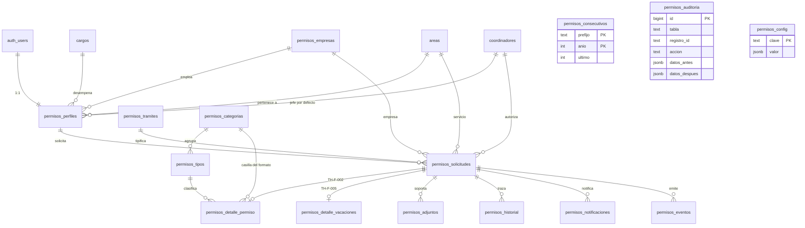
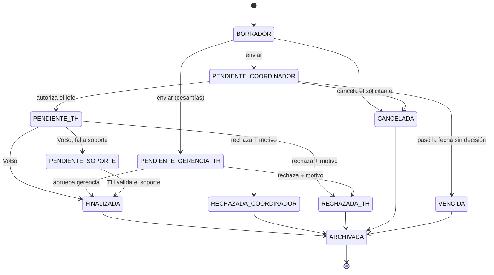
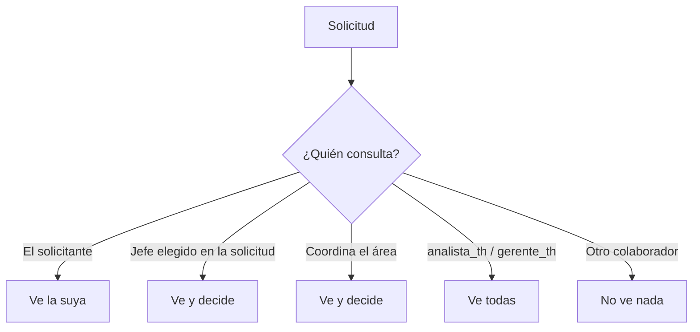

# Modelo de datos

## Diagrama

`permisos_auditoria`, `permisos_config` y `permisos_consecutivos` no tienen
relaciones formales: la primera registra cualquier tabla por nombre, la segunda
guarda parámetros sueltos y la tercera lleva el contador por prefijo y año.

## Tablas compartidas con Cambio de Turnos

Estas **no** llevan prefijo porque pertenecen a la otra aplicación. Permisos las
lee siempre y las escribe solo desde Administración.

| Tabla | Filas | Uso aquí |
|---|---|---|
| `areas` | 16 | Servicio del colaborador y de la solicitud |
| `cargos` | 17 | Cargo del colaborador |
| `coordinadores` | 23 | Jefes directos que pueden autorizar |
| `auth.users` | — | Autenticación común a ambas apps |
| `profiles` | 24 | Solo lectura, para importar personas a Permisos |

> Una persona que coordina varios servicios tiene **una fila por servicio** en
> `coordinadores`. No son duplicados.

## Flujo de estados

`PENDIENTE_SOPORTE` cuenta como aprobada en las métricas: el permiso ya se
disfrutó, lo que falta es el papel.

## Quién ve qué

Se reconoce al jefe **elegido en la solicitud** y también a quien coordine el
área, para que las solicitudes antiguas sin jefe asignado no queden huérfanas.
Ver [SECURITY.md](SECURITY.md).
